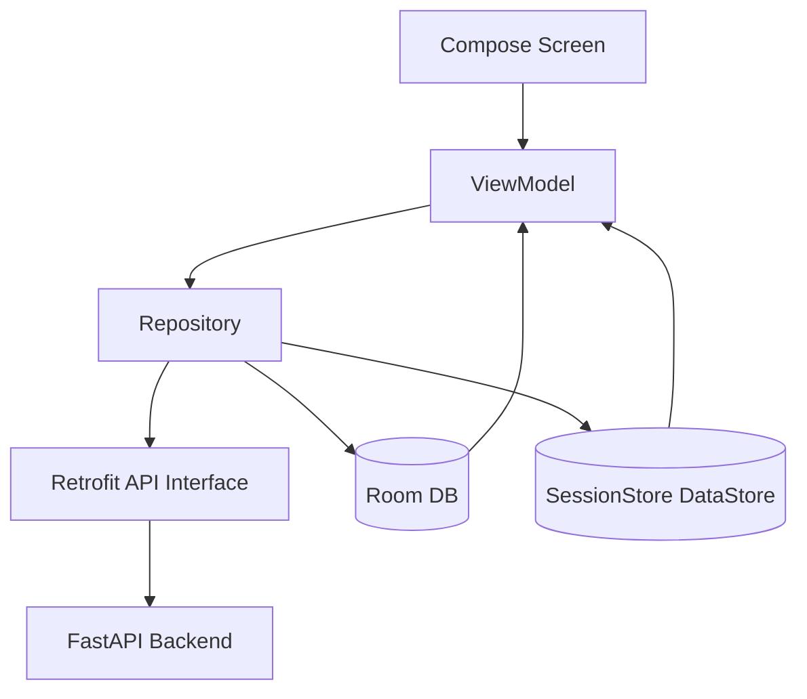
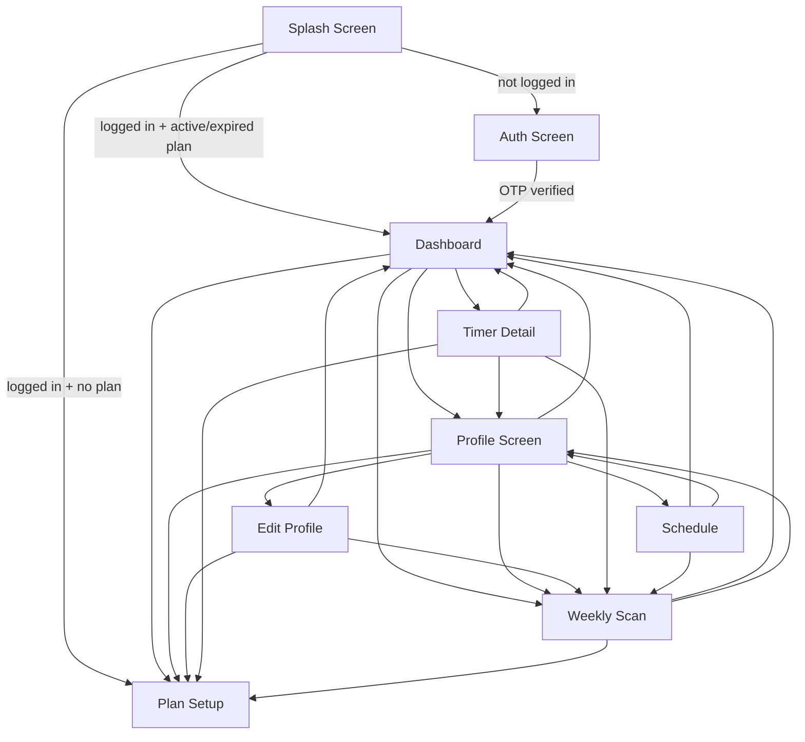
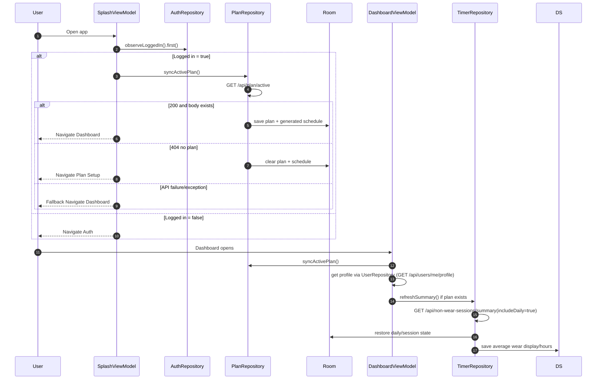
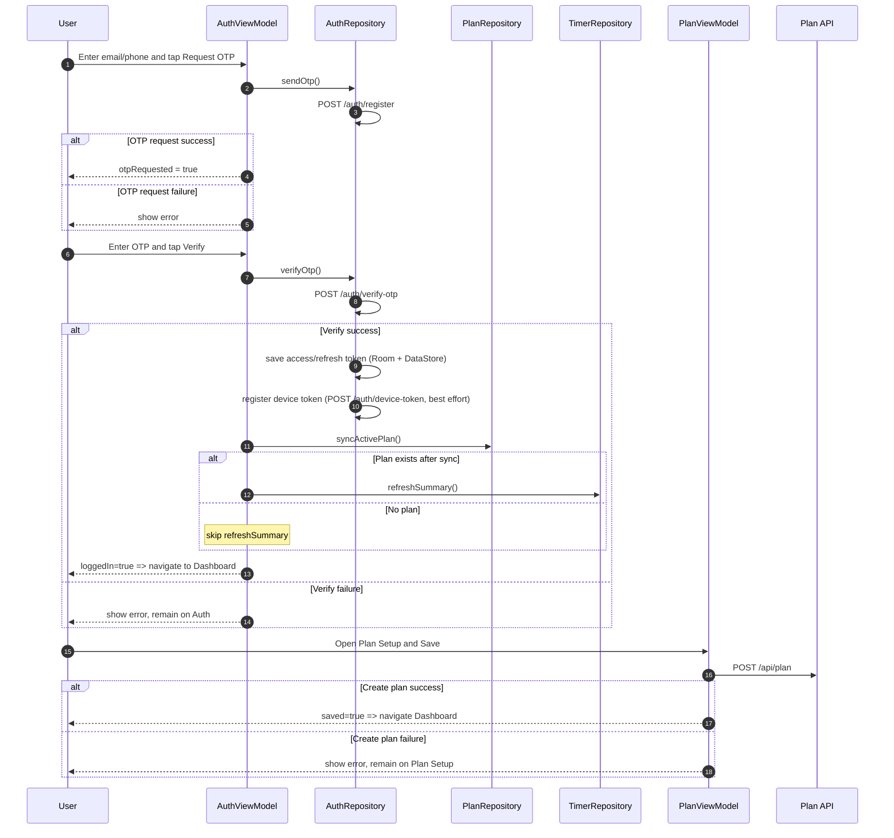

# Smylo App Flow and API Map

This document explains:
- how users move across screens,
- which screen/viewmodel/repository calls which API,
- what happens on success and failure,
- split into 2 main flows:
  1) existing user with active plan, and
  2) new user with no plan.

---

## 1) High-level architecture flow

---

## 2) Navigation map (screen-to-screen)

Start destination is always `SPLASH`.

---

## 3) API inventory (what exists in app)

### Auth APIs
- `POST /auth/register` (request OTP)
- `POST /auth/verify-otp` (verify OTP and return tokens)
- `POST /auth/refresh` (refresh access token)
- `POST /auth/device-token` (register FCM token)
- `DELETE /auth/device-token?fcmToken=...` (unregister on logout)

### Plan APIs
- `POST /api/plan` (create plan)
- `GET /api/plan/active` (active plan lookup)
- `GET /api/plan/schedule` (server schedule)

### Timer/Notification APIs
- `POST /api/non-wear-sessions` (sync closed timer session)
- `GET /api/non-wear-sessions/summary?planId=...&includeDaily=true|false`
- `POST /api/notifications/dispatch` (non-wear threshold/milestone dispatch)

### Profile APIs
- `GET /api/users/me/profile`
- `PATCH /api/users/me/profile`
- `POST /api/users/me/profile/image` (multipart upload)

---

## 4) Detailed flow: Existing user with active plan

### Success and failure behavior in this flow

- **Splash login check success + active plan exists**
  - Action: navigate `SPLASH -> DASHBOARD`.
- **Splash sees 404 on active plan**
  - Action: clear local plan/schedule and navigate `SPLASH -> PLAN_SETUP`.
- **Splash plan sync throws error**
  - Action: navigate `SPLASH -> DASHBOARD` fallback.
- **Dashboard profile fetch success**
  - Action: set `userName` and `profileImageUrl`.
- **Dashboard profile fetch failure**
  - Action: keep defaults (`Patient` / null image), log error, screen still usable.
- **Dashboard summary refresh success**
  - Action: update average wear info in `SessionStore`, restore sessions/summaries to Room, restore active timer if server says one is running.
- **Dashboard summary refresh failure**
  - Action: log error only; dashboard continues with local state.

---

## 5) Detailed flow: New user (or user with no active plan)

### Success and failure behavior in this flow

- **Request OTP success**
  - Action: set `otpRequested = true` and show OTP entry UI.
- **Request OTP failure**
  - Action: set `error`, remain on auth screen.
- **Verify OTP success**
  - Action:
    - store auth session,
    - best-effort FCM registration,
    - sync plan,
    - if plan exists then fetch timer summary,
    - set `loggedIn = true` and navigate to dashboard.
- **Verify OTP failure**
  - Action: set `error`, remain on auth screen.
- **Create plan success**
  - Action: store new plan and generated schedule in DB, set `saved = true`, navigate `PLAN_SETUP -> DASHBOARD`.
- **Create plan failure**
  - Action: set `error`, remain on plan setup.

---

## 6) Screen-by-screen API call map

## `SPLASH`
- **Trigger:** app start.
- **Calls:**
  - auth state from local DB (`observeLoggedIn().first()`),
  - `GET /api/plan/active` via `syncActivePlan()`.
- **Navigation outcomes:**
  - not logged in -> `AUTH`,
  - logged in + no plan -> `PLAN_SETUP`,
  - logged in + plan -> `DASHBOARD`,
  - sync error -> fallback `DASHBOARD`.

## `AUTH`
- **Request OTP button**
  - API: `POST /auth/register`.
  - Success: show OTP state.
  - Failure: show error.
- **Verify OTP button**
  - API: `POST /auth/verify-otp`.
  - Side effects on success:
    - save token/session,
    - best effort `POST /auth/device-token`,
    - sync active plan (`GET /api/plan/active`),
    - if plan exists -> `GET /api/non-wear-sessions/summary`.
  - Navigation: `AUTH -> DASHBOARD` on success.
  - Failure: show error.

## `DASHBOARD`
- **On init**
  - `GET /api/plan/active` (sync),
  - `GET /api/users/me/profile`,
  - if plan exists: `GET /api/non-wear-sessions/summary`.
- **Pull-to-refresh**
  - repeats plan sync + summary refresh.
- **Timer actions**
  - Start: local DB start + Alarm scheduling (no immediate session sync API).
  - Stop: `POST /api/non-wear-sessions` + then `GET /api/non-wear-sessions/summary`.
- **Notification dispatch from dashboard when timer is running**
  - one foreground catch-up call to `POST /api/notifications/dispatch` based on elapsed milestones.
- **Logout**
  - `DELETE /auth/device-token` (best effort), then local DB/DataStore clear.

## `PLAN_SETUP`
- **Save Plan**
  - API: `POST /api/plan`.
  - Success: save plan/schedule locally and navigate to dashboard.
  - Failure: show error.

## `SCHEDULE`
- **On open**
  - API: `GET /api/plan/schedule`.
  - Success: show schedule list.
  - Failure: set error state.

## `PROFILE` / `EDIT_PROFILE`
- **Load profile**
  - API: `GET /api/users/me/profile`.
- **Save text profile**
  - API: `PATCH /api/users/me/profile`.
  - Success: clear `hasChanges`, show success snackbar.
  - Failure: set error snackbar.
- **Upload image**
  - API: `POST /api/users/me/profile/image`.
  - Success: update profile image + success snackbar.
  - Failure: error snackbar.

## `TIMER_DETAIL`
- Uses same timer start/stop flow as dashboard through `TimerRepository`.
- Profile image load calls `GET /api/users/me/profile` in `TimerViewModel`.

---

## 7) Plan state handling (active vs expired vs no plan)

- **No plan (`plan == null`)**
  - Dashboard shows "No active plan yet" and CTA to create plan.
- **Plan expired (`plan_status = expired`)**
  - Dashboard shows "Plan finished" card and CTA to start new plan.
- **Plan active**
  - Dashboard shows phase progress, avg wear, non-wear timer controls, scan/check-up UI.

---

## 8) Background workers affecting flow

- `TimerCheckWorker` (one-time self-rescheduling every ~5 min):
  - syncs unsynced timer sessions using `POST /api/non-wear-sessions`,
  - sends local daily reminder notification after 8 PM (once/day),
  - always re-enqueues itself.
- `TokenRefreshWorker` (periodic daily):
  - calls `POST /auth/refresh`,
  - on refresh failure inside repository, session may be logged out.

---

## 9) Quick mapping table (screen -> api -> success/failure)

| Screen | API(s) | On success | On failure |
|---|---|---|---|
| Splash | `GET /api/plan/active` | route to dashboard or plan setup based on data | fallback route to dashboard |
| Auth (request) | `POST /auth/register` | OTP mode enabled | error shown |
| Auth (verify) | `POST /auth/verify-otp` + optional `POST /auth/device-token` | login true, plan sync, maybe summary refresh, navigate dashboard | error shown, stay auth |
| Dashboard init | `GET /api/plan/active`, `GET /api/users/me/profile`, optional summary API | state hydrated | default/fallback state kept |
| Plan setup save | `POST /api/plan` | save true, navigate dashboard | error shown |
| Schedule | `GET /api/plan/schedule` | schedule visible | error state |
| Profile load | `GET /api/users/me/profile` | fields populated | error shown |
| Profile save | `PATCH /api/users/me/profile` | success message, hasChanges false | error shown |
| Profile image | `POST /api/users/me/profile/image` | image updated | error shown |
| Timer stop | `POST /api/non-wear-sessions` + summary API | session synced + summary restored | unsynced kept locally for retry |

