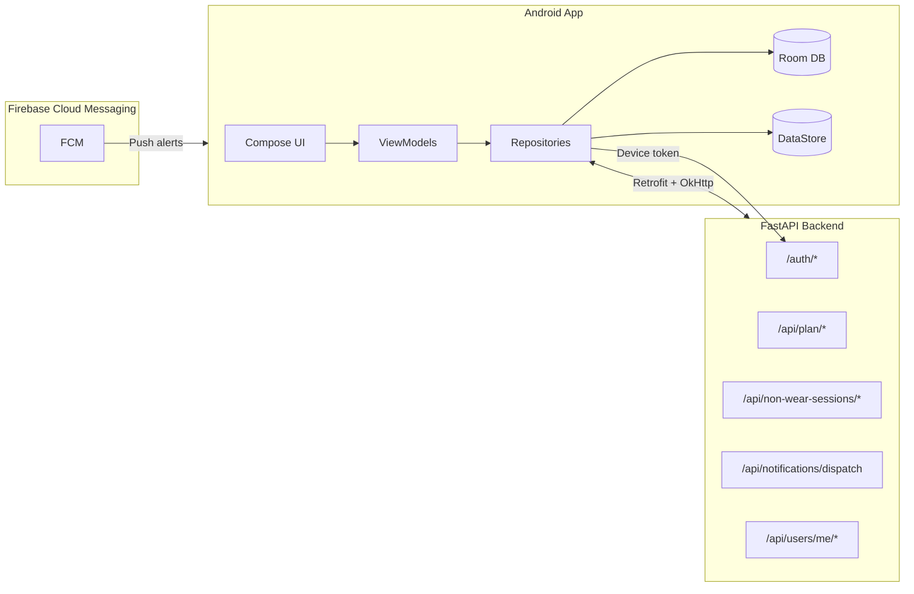
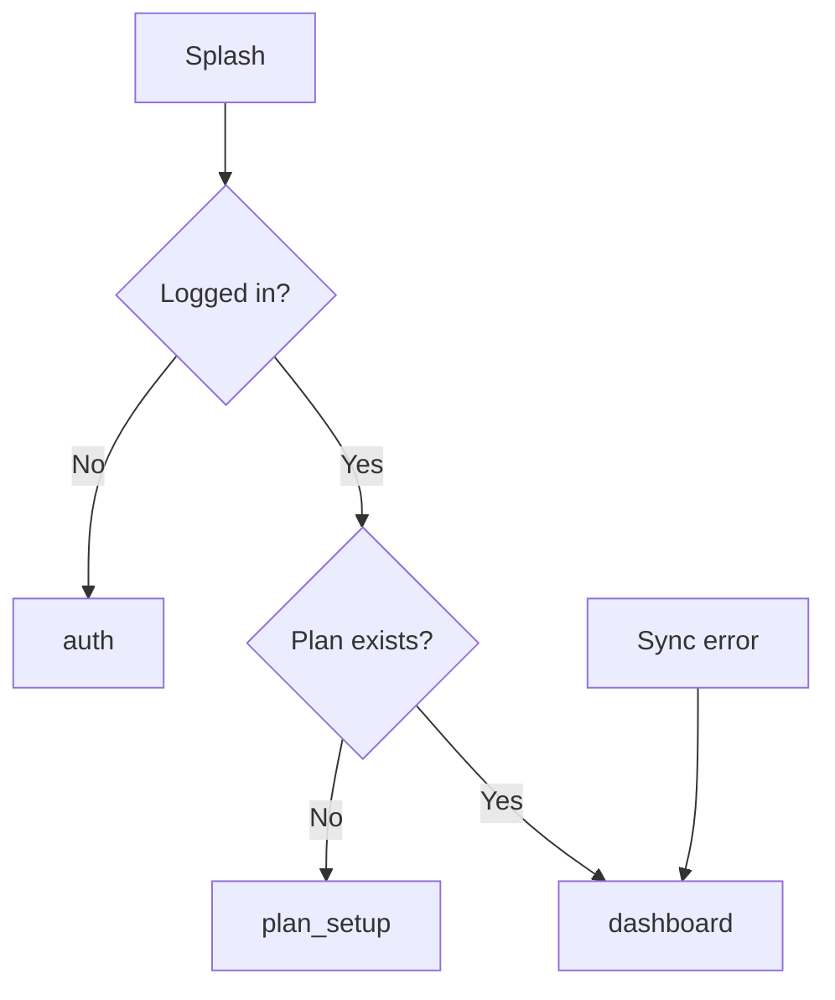
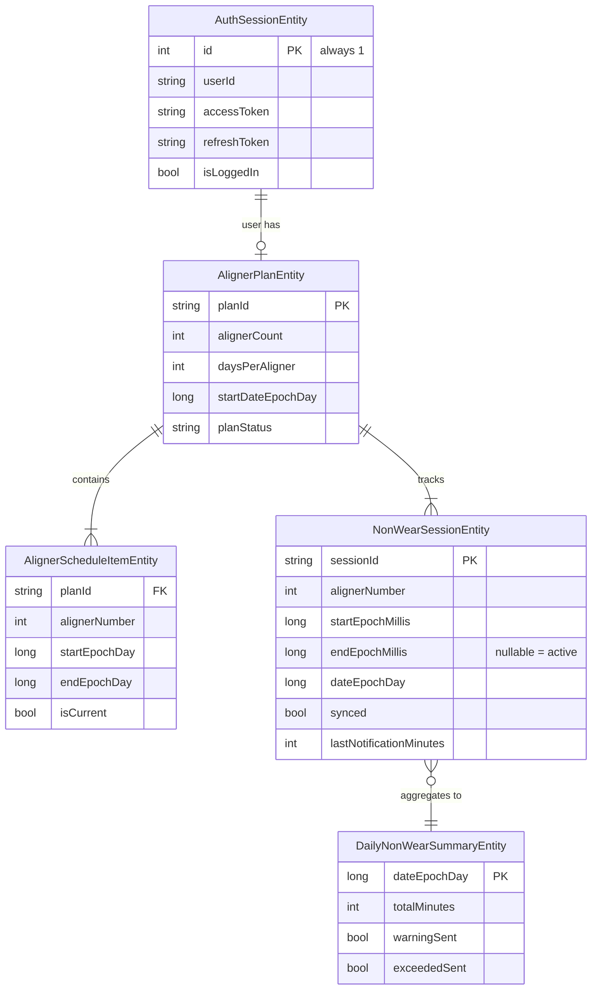
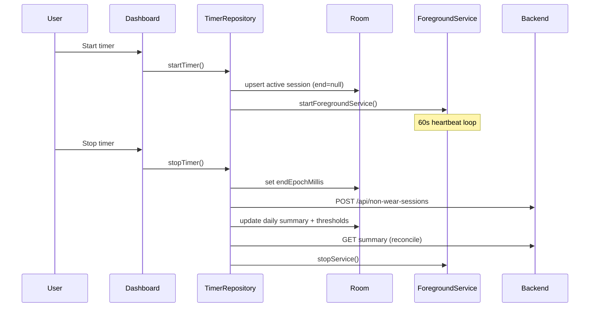

# Smylo — Design Document

> **Version:** MVP (Android client)  
> **Last updated:** July 2026  
> **Audience:** Engineers, designers, and product stakeholders

---

## Table of Contents

1. [Product Vision](#1-product-vision)
2. [System Context](#2-system-context)
3. [Architecture](#3-architecture)
4. [Package Structure](#4-package-structure)
5. [Navigation](#5-navigation)
6. [Feature Specifications](#6-feature-specifications)
7. [Data Model](#7-data-model)
8. [API Integration](#8-api-integration)
9. [Sync & Offline Strategy](#9-sync--offline-strategy)
10. [Non-Wear Timer Design](#10-non-wear-timer-design)
11. [Streak Calculation](#11-streak-calculation)
12. [Notifications](#12-notifications)
13. [Authentication & Security](#13-authentication--security)
14. [UI Design System](#14-ui-design-system)
15. [Background Execution](#15-background-execution)
16. [Testing Strategy](#16-testing-strategy)
17. [Known Gaps & Doc Drift](#17-known-gaps--doc-drift)
18. [Related Documentation](#18-related-documentation)

---

## 1. Product Vision

**Smylo** is a patient-facing Android app for clear-aligner orthodontic treatment. It helps users stay compliant by:

- Tracking **non-wear time** (time aligners are removed)
- Visualizing **treatment progress** across trays
- Maintaining a **daily logging streak**
- Receiving **threshold alerts** when non-wear exceeds clinical limits
- Managing their **profile** and performing **weekly dental scans**

The app is designed **offline-first**: timer sessions, plans, and auth persist locally in Room; network sync is best-effort with retry.

---

## 2. System Context



| Component | Role |
|-----------|------|
| Android client | UI, local persistence, foreground timer, background sync |
| FastAPI backend | Auth, plan authority, session sync, notification orchestration |
| FCM | Delivers user-facing alerts triggered by backend after dispatch API |

**Base URL:** configured via `API_BASE_URL` Gradle property (default `http://10.0.2.2:8000/` for emulator).

---

## 3. Architecture

### Pattern

**MVVM + Repository + Hilt DI**

```
Compose Screen
    ↓ user events
ViewModel (StateFlow / Flow)
    ↓ suspend / Flow
Repository (@Singleton)
    ↓
┌──────────────┬──────────────┬──────────────┐
│  Retrofit    │  Room DAO    │  DataStore   │
│  (network)   │  (local DB)  │  (prefs)     │
└──────────────┴──────────────┴──────────────┘
```

### Principles

| Principle | Implementation |
|-----------|----------------|
| Single source of truth | Room for entities; DataStore for tokens and cached wear stats |
| Reactive UI | Room `Flow` + `combine` / `flatMapLatest` in ViewModels |
| Offline-first timer | Sessions written locally on start/stop; sync retried in background |
| Server-authoritative plan | Schedule fetched from backend, not generated on device |
| Thin domain layer | Pure rules isolated (e.g. `TimerThresholdEvaluator`) |

### Entry Points

| File | Responsibility                                                       |
|------|----------------------------------------------------------------------|
| `BracesApp.kt` | `@HiltAndroidApp`, WorkManager initialization                        |
| `MainActivity.kt` | Edge-to-edge window, FCM token registration, notification permission |
| `App.kt` | `SmyloTheme` + `AppNavHost` root                                     |

---

## 4. Package Structure

```
com.example.smylo/
├── MainActivity.kt, App.kt, BracesApp.kt
├── navigation/              Routes, AppNavHost
├── di/                        NetworkModule, DatabaseModule, PreferencesModule
├── ui/theme/                  Color, Theme, Typography
├── core/
│   ├── common/                Shared models, TimeUtils, Components
│   ├── database/              AppDatabase, entities, DAOs
│   ├── network/               Retrofit APIs, DTOs, JwtPayloadParser
│   └── preferences/           SessionStore (DataStore)
└── feature/
    ├── auth/                  OTP login, token refresh
    ├── plan/                  Plan creation, schedule management
    ├── timer/                 Non-wear timer, wear history
    ├── dashboard/             Aggregated home screen
    ├── profile/               User profile CRUD
    ├── scan/                  Weekly scan (CameraX)
    └── notifications/         FCM, workers, foreground service
```

**Layering per feature:**

| Layer | Contents |
|-------|----------|
| `presentation` | Compose screens, `@HiltViewModel` |
| `data` | `@Singleton` repositories |
| `domain` | Pure Kotlin business rules (minimal today) |

---

## 5. Navigation

### Routes

| Route | Screen | Access |
|-------|--------|--------|
| `splash` | Splash | Start destination |
| `auth` | OTP login | Unauthenticated users |
| `plan_setup` | Create plan | No active plan |
| `dashboard` | Home / progress | Authenticated + plan |
| `timer_detail` | Weekly non-wear summary | From dashboard |
| `daily_wear_detail` | Per-day session breakdown | From timer detail |
| `schedule` | Tray schedule editor | From plan tab |
| `scan` | Weekly dental scan | Bottom nav |
| `profile` | User profile | Bottom nav |
| `edit_profile` | Edit name, DOB, photo | From profile |

### Splash Routing



| Condition | Destination |
|-----------|-------------|
| Not logged in | `auth` |
| Logged in, no plan | `plan_setup` |
| Logged in, plan exists | `dashboard` |
| Sync failure on splash | `dashboard` (fallback) |

### Bottom Navigation

Shared across Dashboard, Schedule, Scan, and Profile:

| Tab | Route |
|-----|-------|
| Progress | `dashboard` |
| Plan | `schedule` (or `plan_setup` if no/expired plan) |
| Scan | `scan` |
| Profile | `profile` |

---

## 6. Feature Specifications

### 6.1 Authentication

**Flow:** Email/phone → `POST /auth/register` → OTP → `POST /auth/verify-otp` → persist session.

| Step | Behavior |
|------|----------|
| Register | Send OTP to email or phone |
| Verify | Receive access + refresh tokens; save to Room + DataStore |
| FCM | Best-effort `POST /auth/device-token` after login |
| Post-login | Sync active plan; refresh timer summary if plan exists |
| Logout | `DELETE /auth/device-token` → `clearAllTables()` + DataStore clear |
| Token refresh | OkHttp 401 authenticator + daily `TokenRefreshWorker` |

### 6.2 Plan & Schedule

**Plan creation:** User sets aligner count (default 14), days per aligner (default 7), start date → `POST /api/plan` → fetch schedule from server.

**Plan states:**

| State | Condition | UI behavior |
|-------|-----------|-------------|
| No plan | `GET /api/plan/active` returns 404 | Clear local data; route to plan setup |
| Active | Plan exists, not expired | Full dashboard |
| Expired | `planStatus == "expired"` | Show completion message; limited actions |

**Schedule:** Server-generated via `GET /api/plan/schedule`. Per-tray date ranges stored in `aligner_schedule`. Current tray resolved by `isCurrent` flag or date-range match.

**Schedule edits:** User adjusts days per aligner (min 1) → `PATCH /api/plan/aligners` → full re-sync.

**Progress metrics:**

| Metric | Formula |
|--------|---------|
| Transformation progress % | `currentAlignerNumber / alignerCount` |
| Days left in tray | `endEpochDay - today` |
| Tray progress | `daysPassedInAligner / totalDaysInAligner` |

### 6.3 Dashboard

Aggregates data from `PlanRepository`, `TimerRepository`, `AuthRepository`, and `SessionStore`.

| Widget | Data source |
|--------|-------------|
| Greeting | `TimeUtils.getGreeting()` (time-of-day) |
| Current tray / days left | Plan schedule |
| Transformation progress | Aligner number / total |
| Average daily wear | `SessionStore` (from API summary) |
| Non-wear timer | `TimerRepository.observeTimerState()` |
| Day streak | `TimerRepository.observeStreakDays()` |
| Motivational text | Progress threshold bands |

**Actions:** Start/stop timer, pull-to-refresh (plan + summary sync).

### 6.4 Non-Wear Timer

See [Section 10](#10-non-wear-timer-design) for full timer design.

**Screens:**

| Screen | Purpose |
|--------|---------|
| Dashboard timer card | Quick start/stop + today's total |
| Timer detail | Weekly summary chart |
| Daily wear detail | Per-day session list + compliance breakdown |

### 6.5 Profile

| Action | API |
|--------|-----|
| Load profile | `GET /api/users/me/profile` |
| Update fields | `PATCH /api/users/me/profile` |
| Upload photo | `POST /api/users/me/profile/image` (multipart) |

### 6.6 Weekly Scan

CameraX-based capture UI. AI analysis flow is placeholder/MVP — camera preview and scan marketing screen only.

---

## 7. Data Model

### Room Entities (schema v5)



### DataStore (`SessionStore`)

| Key | Purpose |
|-----|---------|
| `authToken` | Bearer access token |
| `refreshToken` | Token refresh |
| `isLoggedIn` | Auth flag |
| `averageWearHours` | Cached from API summary |
| `averageWearDisplay` | Formatted display string |
| `fcmToken` | Firebase device token |
| `lastDailyReminderDay` | Prevents duplicate daily reminders |

### In-Memory UI Models

| Model | Used by |
|-------|---------|
| `TimerState` | Dashboard, timer screens |
| `DashboardUiState` | Dashboard |
| `AlignerPlan`, `AlignerScheduleItem` | Plan features (mapped from entities) |
| `ThresholdState` | Timer threshold evaluation |

---

## 8. API Integration

### Endpoints

| Domain | Method | Path | Purpose |
|--------|--------|------|---------|
| Auth | POST | `/auth/register` | Send OTP |
| Auth | POST | `/auth/verify-otp` | Verify OTP, get tokens |
| Auth | POST | `/auth/refresh` | Refresh access token |
| Auth | POST | `/auth/device-token` | Register FCM token |
| Auth | DELETE | `/auth/device-token` | Unregister FCM token |
| Plan | POST | `/api/plan` | Create plan |
| Plan | GET | `/api/plan/active` | Fetch active plan |
| Plan | GET | `/api/plan/schedule` | Fetch tray schedule |
| Plan | PATCH | `/api/plan/aligners` | Update days per aligner |
| Timer | POST | `/api/non-wear-sessions` | Sync closed session |
| Timer | GET | `/api/non-wear-sessions/summary` | Summary + daily breakdown |
| Notifications | POST | `/api/notifications/dispatch` | Trigger backend alerts |
| Profile | GET/PATCH | `/api/users/me/profile` | Read/update profile |
| Profile | POST | `/api/users/me/profile/image` | Upload profile photo |

### HTTP Client

- **Retrofit** + Gson (snake_case JSON via `@SerializedName`)
- **OkHttp** Bearer interceptor reads token from DataStore/Room
- **401 handling:** Authenticator attempts refresh; on failure clears all local data
- **Cleartext HTTP:** Allowed via `network_security_config.xml` for dev emulator

---

## 9. Sync & Offline Strategy

| Data | Authority | Offline behavior |
|------|-----------|------------------|
| Auth session | Local + server | Tokens in Room/DataStore; refresh on 401 |
| Aligner plan | Server | Cached in Room; 404 clears local |
| Schedule | Server | Fetched after plan create/sync |
| Non-wear sessions | Local-first | Written on start/stop; `synced` flag for retry |
| Daily summary | Local + server | Updated on stop; reconciled via summary API |
| Average wear hours | Server | Cached in DataStore after summary fetch |
| Profile | Server | Fetched on screen enter |

### Sync Triggers

| Trigger | Actions |
|---------|---------|
| App splash (logged in) | `syncActivePlan()`, `refreshSummary()` |
| OTP login success | Plan sync + timer summary |
| Timer stop | `POST` session → `GET` summary |
| Pull-to-refresh | Plan sync + forced summary refresh |
| `TimerForegroundService` (60s) | Milestone dispatch + pending session sync |
| `TimerCheckWorker` (15 min) | Unsynced session retry + daily reminder |
| `TokenRefreshWorker` (daily) | Proactive token refresh |

### Summary Refresh Debounce

`TimerRepository.refreshSummary()` skips if last refresh was < 10 minutes unless `force = true`.

---

## 10. Non-Wear Timer Design

### Lifecycle



### Rules

| Rule | Value / behavior |
|------|------------------|
| Concurrent sessions | One active session max (duplicate start ignored) |
| Aligner at session start | `(today - plan.startDate) / daysPerAligner + 1`, capped at `alignerCount` |
| Warning threshold | 90 minutes daily non-wear |
| Limit threshold | 120 minutes daily non-wear |
| Threshold evaluation | On stop via `TimerThresholdEvaluator` |
| Manual sessions | `addManualSession(start, end)` supported |
| Active session display | `todayTotalMillis + (now - activeStart)` when running |

### Notification Milestones

| Setting | Value |
|---------|-------|
| Interval | Every 10 minutes of active session elapsed |
| Dispatch code | `"NF100"` |
| Tracking | `lastNotificationMinutes` on session entity |
| Concurrency | `Mutex` prevents duplicate dispatches |
| Display | Backend sends FCM; app relies on push for user-facing alert |

---

## 11. Streak Calculation

The dashboard **Day Streak** counts consecutive days the user logged qualifying non-wear time.

### Qualifying Day

A day qualifies when the user has **at least one closed** non-wear session where:

```
(endEpochMillis - startEpochMillis) >= 2 minutes
```

Constant: `TimeUtils.STREAK_MIN_SESSION_MILLIS = 120_000`

### Streak Algorithm

1. Start counting from **yesterday** (not today — user has the full day to log)
2. Walk backward day by day while each day qualifies
3. Stop at the first non-qualifying day (streak breaks)
4. Do not count days before `plan.startDateEpochDay`

```
Example:
  Yesterday     → qualifying ✓
  2 days ago    → qualifying ✓
  3 days ago    → missing     ✗  ← streak stops here
  4 days ago    → qualifying (ignored)

  Streak = 2
```

### Reactive Updates

`TimerRepository.observeStreakDays()` observes qualifying days from Room and recalculates via `TimeUtils.calculateStreakDays()`. Updates automatically when sessions are added or stopped.

---

## 12. Notifications

### Channels

| Channel | Importance | Use |
|---------|------------|-----|
| Service | Low | Foreground timer persistence |
| Timer alerts | High | Threshold / milestone alerts |
| Daily reminders | High | End-of-day summary nudge |

### Components

| Component | Role |
|-----------|------|
| `BracesFirebaseMessagingService` | Receives FCM; shows local notification |
| `TimerForegroundService` | Persistent chronometer notification while timer runs |
| `NotificationHelper` | Channel creation, notification builders |
| `TimerCheckWorker` | Periodic sync + 8 PM daily reminder (once/day) |
| `BootReceiver` | Restarts foreground service if active session after reboot |

### Daily Reminder

- Fires after **8:00 PM** local time
- Once per calendar day (`lastDailyReminderDay` in DataStore)
- Message: prompt to review non-wear summary

---

## 13. Authentication & Security

| Concern | Approach |
|---------|----------|
| Token storage | Room (`AuthSessionEntity`) + DataStore |
| Request auth | OkHttp interceptor adds `Authorization: Bearer` |
| Token expiry | Automatic refresh via OkHttp authenticator |
| Refresh failure | Clear all tables + DataStore (full logout) |
| 401 without refresh token | Session **not** wiped (avoids false logout) |
| User ID resolution | From API response or JWT `sub` via `JwtPayloadParser` |
| Logout | Best-effort device token deletion + local wipe |
| Network (dev) | Cleartext permitted for emulator via security config |

---

## 14. UI Design System

### Design Language

**"High-Tech Clinical"** — clean slate surfaces, cyan-teal primary, amber for caution states.

### Color Tokens

| Token | Hex | Usage |
|-------|-----|-------|
| `PrimaryCyanTeal` | `#0F7BA6` | Primary actions, brand |
| `SecondarySlateTeal` | `#1790BF` | Secondary accents |
| `TertiaryAmber` | `#855400` | Warnings, caution |
| `SurfaceLight` | `#F6FAFB` | Background |
| `OnSurface` | `#171C1D` | Primary text |

Full palette defined in `ui/theme/Color.kt`. `BracesAndAlignerTheme` applies light/dark `ColorScheme` in `Theme.kt`.

### Typography

`Type.kt` — Manrope intended; falls back to system default.

### Shared Components

| Component | Location | Usage |
|-----------|----------|-------|
| `GradientTipCard` | `core/common/Components.kt` | Clinical tip cards on dashboard |
| Bottom navigation bar | Per-screen | Progress, Plan, Scan, Profile |
| `AsyncImage` (Coil) | Profile screens | Profile photo display |

### UX Patterns

- Edge-to-edge layout (`enableEdgeToEdge`)
- Material 3 Scaffold, cards, date pickers
- Pull-to-refresh on dashboard
- Live timer display via 1-second coroutine tick when session is active

---

## 15. Background Execution

| Component | Schedule | Responsibility |
|-----------|----------|----------------|
| `TimerForegroundService` | While timer active | Chronometer notification; 60s loop for milestone dispatch + pending sync |
| `TimerCheckWorker` | Every 15 minutes | Retry unsynced sessions; 8 PM daily reminder |
| `TokenRefreshWorker` | Daily | Proactive token refresh |
| `BootReceiver` | `BOOT_COMPLETED` | Resume foreground service if active session exists |

### Foreground Service Justification

Declared in manifest for reliable non-wear milestone tracking when the app is backgrounded. Persistent notification shows elapsed time.

---

## 16. Testing Strategy

### Current Coverage

| Test | Location | Coverage |
|------|----------|----------|
| `TimerThresholdEvaluatorTest` | `app/src/test/...` | 90/120 min threshold boundaries |

### Recommended Additions

| Area | What to test |
|------|--------------|
| `TimeUtils.calculateStreakDays` | Consecutive days, gaps, plan start boundary, yesterday-only |
| `TimerThresholdEvaluator` | Edge cases at exactly 90 and 120 min |
| Repository integration | Session start/stop, unsynced retry (instrumented) |
| Navigation | Splash routing for auth/plan/dashboard states |

### Manual Test Checklist (Timer)

1. Start timer → session in Room with `endEpochMillis = null`
2. Stop timer → session closed, daily summary updated, API sync attempted
3. Kill app → reopen → active session restored from summary API
4. Reboot device → `BootReceiver` restarts foreground service
5. Log ≥ 2 min → streak increments next day

---

## 17. Known Gaps & Doc Drift

| Item | Status |
|------|--------|
| Dashboard user name | `UserRepository` injected but profile not loaded; shows `"Patient"` |
| Profile logout | Stubbed empty lambda in `AppNavHost` |
| Weekly scan AI | Placeholder UI only |
| `ScheduleGenerator` | Referenced in older docs; removed — schedule is server-generated |
| `AlarmManager` / `TimerAlarmReceiver` | Removed; `NON_WEAR_TIMER_FLOW.md` partially outdated |
| Notification interval docs | Docs mention 5 min; code uses **10 min** |
| Worker interval docs | Docs mention 5 min self-reenqueue; code uses **15 min** periodic |
| `ScheduleGeneratorTest` | Referenced in docs; does not exist |

---

## 18. Related Documentation

| Document | Contents |
|----------|----------|
| [README.md](../README.md) | MVP overview, setup, high-level API |
| [DEVELOPER_GUIDE.md](./DEVELOPER_GUIDE.md) | Beginner walkthrough, libraries, pitfalls |
| [APP_FLOW_AND_API_MAP.md](./APP_FLOW_AND_API_MAP.md) | Navigation graph, API trigger map, sequence diagrams |
| [NON_WEAR_TIMER_FLOW.md](./NON_WEAR_TIMER_FLOW.md) | Timer deep dive (partially outdated — see Section 17) |

---

## Tech Stack Reference

| Category | Technology |
|----------|------------|
| Language | Kotlin 2.1, JVM 17 |
| UI | Jetpack Compose, Material 3 |
| DI | Hilt (+ Navigation Compose, Work) |
| Networking | Retrofit 2.9, Gson, OkHttp |
| Local DB | Room 2.7 (v5) |
| Preferences | DataStore |
| Async | Kotlin Coroutines |
| Background | WorkManager, Foreground Service |
| Push | Firebase Cloud Messaging |
| Images | Coil Compose |
| Camera | CameraX |
| Build | AGP 8.3.2, `compileSdk`/`targetSdk` 35, `minSdk` 24 |
