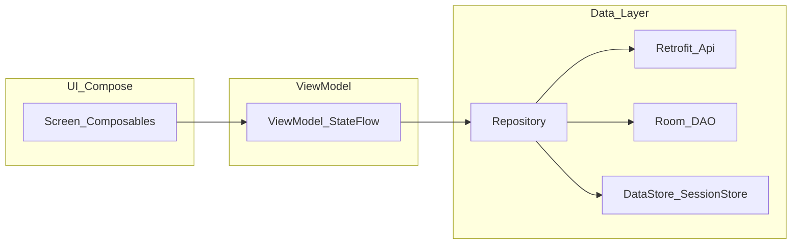
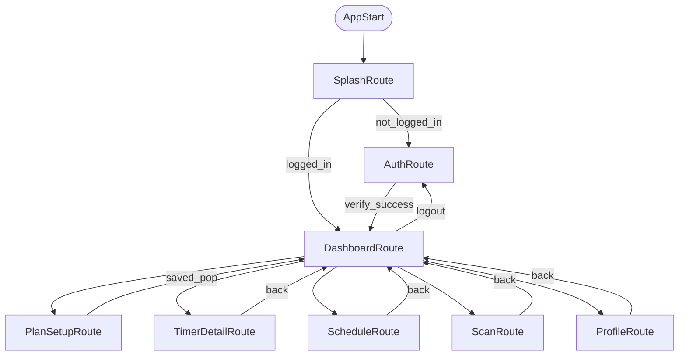
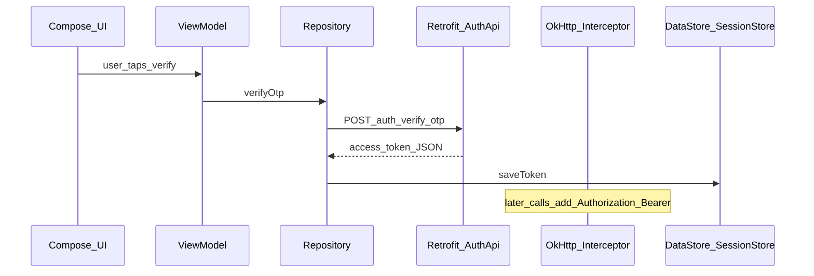

# BracesAndAligner — Developer Guide

This guide is for Kotlin beginners. It explains **which libraries we use and why**, **what each package is for**, and **how data flows** through the app from UI to network and local storage.

---

## 1. Architecture (MVVM)

We use **MVVM** (Model–View–ViewModel):

| Layer | Responsibility | Where it lives |
|--------|------------------|----------------|
| **View (UI)** | Draws screens, handles taps/typing. No business rules. | `feature/*/presentation/*Screen*.kt`, `ui/theme/` |
| **ViewModel** | Holds UI state, survives rotation. Calls repository on user actions. | `feature/*/presentation/*ViewModel.kt` |
| **Repository** | Single place for “get/save data”: combines **API + Room + DataStore**. | `feature/*/data/*Repository.kt` |
| **API (Retrofit)** | HTTP calls to your FastAPI backend. | `core/network/api/*.kt`, `core/network/dto/*.kt` |
| **Database (Room)** | Local tables for offline and fast reads. | `core/database/*.kt` |
| **DI (Hilt)** | Wires dependencies (ViewModels get repositories automatically). | `di/*.kt`, `@HiltAndroidApp`, `@AndroidEntryPoint` |

---

## 2. Libraries and why we use them

Declared in [`gradle/libs.versions.toml`](../gradle/libs.versions.toml) and used in [`app/build.gradle.kts`](../app/build.gradle.kts).

| Library | Role | Why we use it |
|---------|------|----------------|
| **Kotlin** | Language | Modern, concise, official for Android. |
| **Jetpack Compose** (`compose-ui`, `material3`, `material-icons-extended`) | UI | Declarative UI; less XML; Material 3 design system. |
| **Activity Compose** | Entry | Lets `MainActivity` call `setContent { ... }`. |
| **Navigation Compose** | Screens | Typed routes, back stack, deep links later. |
| **Lifecycle + `lifecycle-runtime-compose` + `viewmodel-compose`** | Lifecycle | `collectAsStateWithLifecycle()` avoids leaks; ViewModels survive config changes. |
| **Hilt** (`hilt-android`, `kapt` compiler) | Dependency injection | `@Inject` constructors, `@HiltViewModel` — no manual singletons. |
| **Hilt Navigation Compose** | ViewModels per route | `hiltViewModel()` scoped to navigation back stack entry. |
| **Hilt Work** (`hilt-work` + compiler) | Worker injection | Lets `Worker` classes get repositories/services via Hilt. |
| **Retrofit + Gson converter** | REST client | Standard way to call FastAPI; maps JSON to Kotlin data classes (`dto`). |
| **OkHttp + Logging interceptor** | HTTP engine | Timeouts, interceptors (e.g. **Bearer token**), debug logs in dev. |
| **Room** | SQLite ORM | Offline-first: plans, sessions, auth row persisted locally. |
| **DataStore (Preferences)** | Key-value settings | Stores auth token for OkHttp interceptor; survives process death. |
| **Kotlin Coroutines (Android)** | Async | `suspend` network/DB; `viewModelScope.launch`. |
| **WorkManager** | Background work | Periodic timer/reminder checks when app is in background. |
| **Firebase Cloud Messaging** | Push | Server can send reminders; `FirebaseMessagingService` receives messages. |
| **Material Components (XML theme parent)** | App theme bridge | `Theme.Material3.DayNight` resources for manifest theme. |
| **JUnit 4** | Unit tests | Tests pure logic (e.g. schedule generation). |

---

## 3. Package map (what folder is for what)

Root package: `com.example.bracesaligner`

| Package | Purpose |
|---------|---------|
| `MainActivity.kt`, `App.kt`, `BracesApp.kt` | App entry: Activity sets Compose root; `BracesApp` is `@HiltAndroidApp`; schedules WorkManager on start. |
| `navigation/` | `Routes.kt` — route string constants. `AppNavHost.kt` — connects each route to a **Screen + ViewModel**. |
| `ui/theme/` | Colors, typography, `BracesAndAlignerTheme` — Material 3 look for Compose. |
| `di/` | Hilt modules: provide **Retrofit**, **OkHttp**, **Room**, **DataStore** as singletons. |
| `core/common/` | Small shared models and `TimeUtils` (dates as epoch day/millis). |
| `core/network/` | **API**: Retrofit interfaces, request/response DTOs, `JwtPayloadParser` (read `sub` from JWT when backend omits `user_id`). |
| `core/database/` | **Room**: `AppDatabase`, entities, DAOs. |
| `core/preferences/` | **DataStore**: `SessionStore` (token for `Authorization` header). |
| `feature/auth/` | Login: `presentation` (UI + ViewModels), `data` (`AuthRepository`). |
| `feature/plan/` | Aligner plan + schedule: `data` (`PlanRepository`), `domain` (`ScheduleGenerator`), `presentation`. |
| `feature/timer/` | Non-wear timer: `data` (`TimerRepository`), `domain` (`TimerThresholdEvaluator`), `presentation`. |
| `feature/dashboard/` | Home screen combining plan + timer state. |
| `feature/profile/` | Profile UI (navigation from dashboard). |
| `feature/scan/` | Weekly scan placeholder UI. |
| `feature/notifications/` | Local notifications, `WorkManager` worker, FCM service. |

**Rule of thumb:**  
- **`presentation`** = Compose + ViewModel (what user sees + reacts to).  
- **`data`** = Repository (orchestration).  
- **`domain`** = pure Kotlin rules (no Android imports if possible).  
- **`core`** = shared infrastructure used by many features.

---

## 4. Navigation graph (screens)

Start destination: **`splash`** → then either **`auth`** or **`dashboard`**.

Route constants live in [`navigation/Routes.kt`](../app/src/main/java/com/example/bracesaligner/navigation/Routes.kt).  
Wiring lives in [`navigation/AppNavHost.kt`](../app/src/main/java/com/example/bracesaligner/navigation/AppNavHost.kt).

---

## 5. Flow per screen (what happens when user acts)

### Splash (`Routes.SPLASH`)

1. `SplashScreen()` shows branding + short animation.  
2. `SplashViewModel` waits briefly, then reads whether a session exists (via `AuthRepository.observeLoggedIn()`).  
3. When destination is ready, `LaunchedEffect` in `AppNavHost` **navigates** to `AUTH` or `DASHBOARD` and removes splash from back stack.

### Auth (`Routes.AUTH`)

1. `AuthScreen` collects email, phone, and 6-digit OTP.  
2. **Request OTP** → `AuthViewModel.requestOtp()` → `AuthRepository.sendOtp()` → Retrofit `AuthApi.sendOtp` → `POST /auth/register` with body `email`, `phone`.  
3. **Verify** → `verifyOtp()` → `POST /auth/verify-otp` with `email`, `phone`, `code` → response parsed as `AuthTokenResponse` (supports `access_token`; `userId` from `user_id` or JWT `sub`).  
4. Token saved in **Room** (`AuthSessionEntity`) and **DataStore** (`SessionStore`) for the OkHttp **Bearer** interceptor.  
5. When `loggedIn == true`, navigate to **Dashboard** and clear auth from back stack.

### Dashboard (`Routes.DASHBOARD`)

1. On open, `DashboardViewModel` calls `PlanRepository.syncActivePlan()` so `GET /api/plan/active` stays in sync with the server.  
2. **404** from that endpoint clears local plan + schedule (truly no plan).  
3. **200** with `plan_status` / `planStatus` = `expired` keeps full plan data locally and shows **Plan finished** (not the same as “no plan”).  
4. `DashboardViewModel` combines **plan** + **timer** flows for the main UI.  
5. If session is invalid / logged out, can navigate back to **Auth** (see `LaunchedEffect` in `AppNavHost`).  
6. Buttons open **Plan setup**, **Timer detail**, **Scan**, **Profile** via `navController.navigate(...)`.

### Plan setup (`Routes.PLAN_SETUP`)

1. User sets aligner count (1–30) and days per aligner (7–10).  
2. **Save** → `PlanViewModel.createPlan()` → `PlanRepository` calls API then writes **Room** and generated schedule via `ScheduleGenerator`.  
3. On success, `popBackStack()` returns to dashboard.

### Schedule (`Routes.SCHEDULE`)

1. On enter, `PlanViewModel.fetchSchedule()` loads items for UI state.  
2. `ScheduleScreen` lists aligner ranges (calendar-style list MVP).

### Timer detail (`Routes.TIMER_DETAIL`)

1. `TimerViewModel` exposes `TimerState` and weekly summary from `TimerRepository`.  
2. Start/stop updates **Room** and syncs to API where implemented.

### Profile / Scan

- **Profile**: settings-style navigation hub (plan, schedule, scan links); logout may use dashboard ViewModel depending on wiring.  
- **Scan**: placeholder for future AI weekly scan flow.

---

## 6. Network stack (how API calls get the token)

`NetworkModule` provides:

- **`SessionStore`** read inside an **Interceptor** to add `Authorization: Bearer <token>`.  
- **`HttpLoggingInterceptor`** for development logs (disable or reduce level for production builds if needed).

Base URL is **`BuildConfig.API_BASE_URL`** in `app/build.gradle.kts` (change per machine: emulator `10.0.2.2`, phone = PC LAN IP, production = HTTPS).

---

## 7. Offline and persistence

| Data | Stored in | Why |
|------|-----------|-----|
| Auth session row | Room `auth_session` | Structured query; single row id `1`. |
| Bearer token copy | DataStore | Fast read on every HTTP request in interceptor. |
| Aligner plan + schedule | Room | Works offline; instant UI. |
| Non-wear sessions + daily summary | Room | Timer survives app kill; aggregates by day. |

---

## 8. Background: WorkManager and FCM

- **`TimerCheckWorker`**: periodic task (registered in `BracesApp`) for reminders/summary nudges.  
- **`BracesFirebaseMessagingService`**: receives FCM messages and can show a notification via `NotificationHelper`.  
- **`MainActivity`**: requests `POST_NOTIFICATIONS` on Android 13+ so local notifications can appear.

---

## 9. Testing

- Unit tests live under `app/src/test/java/...` (e.g. `ScheduleGeneratorTest`, `TimerThresholdEvaluatorTest`).  
- Run: `./gradlew.bat testDebugUnitTest`

---

## 10. Common pitfalls (for beginners)

1. **Base URL must end with `/`** for Retrofit relative paths to resolve correctly.  
2. **Auth paths** in code are `POST /auth/register` and `POST /auth/verify-otp` — FastAPI routes must match (including prefix).  
3. **JSON field names**: Backend often uses `snake_case`; DTOs use `@SerializedName` where needed (`AuthTokenResponse`, OTP requests).  
4. **Cleartext HTTP** is only for dev; production should use **HTTPS** and ideally remove `usesCleartextTraffic` or scope it with a network security config.

---

## 11. Where to read next (files)

| Topic | File |
|-------|------|
| All routes + screen wiring | `navigation/AppNavHost.kt` |
| Auth API | `core/network/api/AuthApi.kt` |
| Token + session save | `feature/auth/data/AuthRepository.kt` |
| HTTP client + Retrofit | `di/NetworkModule.kt` |
| Room schema | `core/database/AppDatabase.kt` |
| Theme | `ui/theme/Theme.kt` |

---

*This document reflects the project as of the last update. When you add features, extend the “Flow per screen” section and the navigation diagram.*
