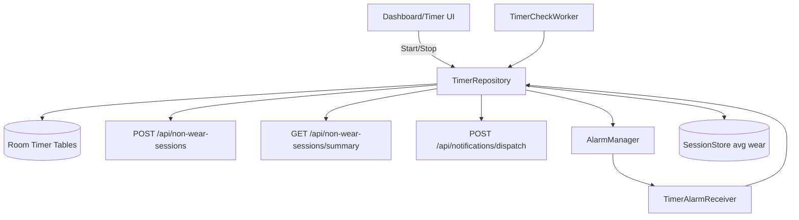
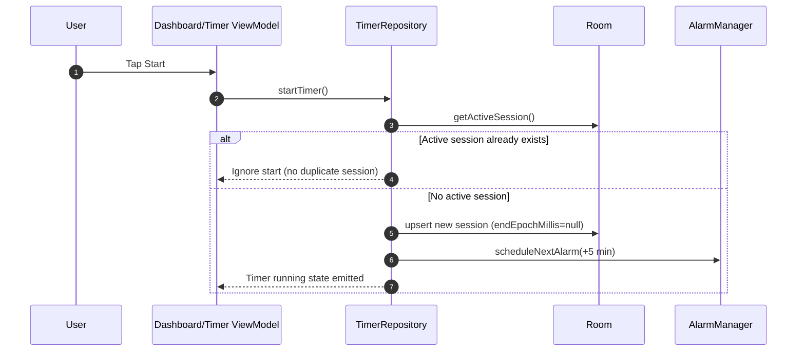
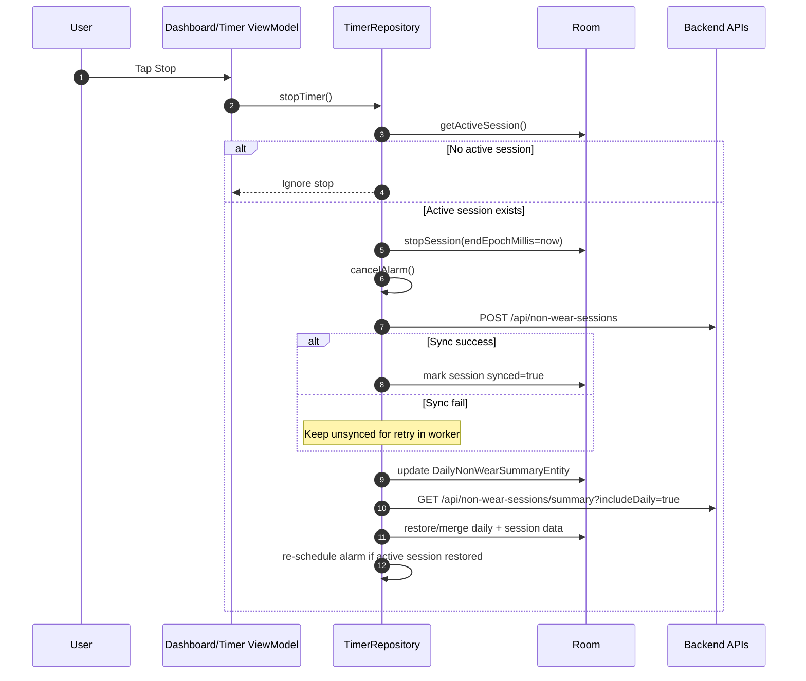
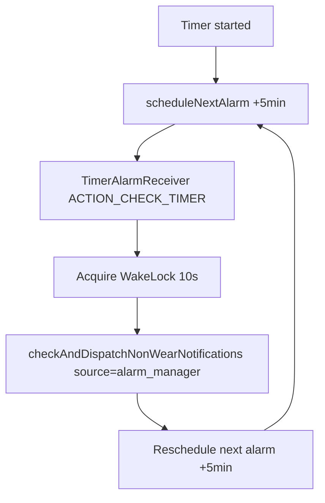
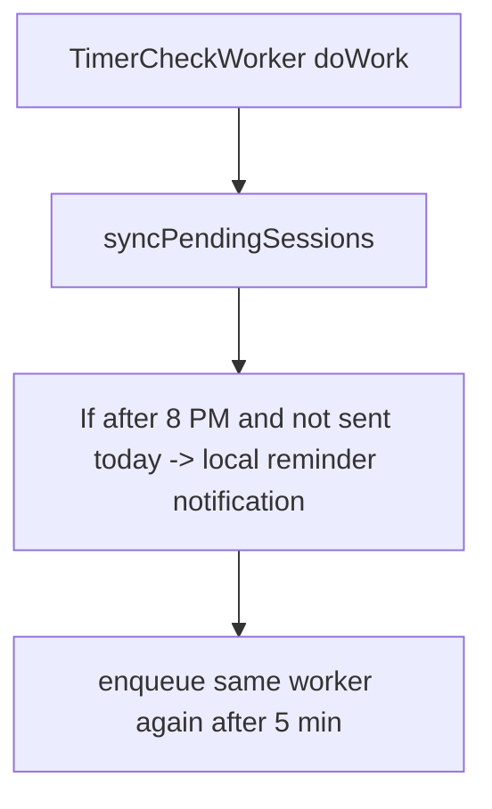

# Non-Wear Timer Flow (Foreground vs Background)

This document explains exactly how the non-wear timer works in app runtime, local persistence, backend sync, and notification dispatch.

---

## 1) Core components

- **UI triggers**
  - `DashboardViewModel.startTimer() / stopTimer()`
  - `TimerViewModel.startTimer() / stopTimer()`
- **Main orchestration**
  - `TimerRepository`
- **Persistence**
  - `NonWearTimerDao` (sessions, daily summaries)
  - `AlignerPlanDao` (current plan context for `planId`, aligner number)
  - `SessionStore` (average wear display/hours)
- **Network**
  - `POST /api/non-wear-sessions`
  - `GET /api/non-wear-sessions/summary`
  - `POST /api/notifications/dispatch`
- **Background execution**
  - `TimerAlarmReceiver` + `AlarmManager` (every ~5 min while running)
  - `TimerCheckWorker` self-reenqueued one-time worker (every ~5 min)

---

## 2) High-level runtime diagram

---

## 3) Start timer flow

### Start success/failure behavior

- **If active session exists**
  - action: start ignored (prevents duplicate active session).
- **If no active session**
  - action: session inserted with generated `sessionId`, computed aligner number, and start time.
  - action: alarm scheduled for next background check.
- **No immediate backend sync happens on start**
  - session sync occurs on stop or later worker retry.

---

## 4) Stop timer flow

### Stop success/failure behavior

- **No active session**
  - action: no-op.
- **Sync API success**
  - action: mark session synced.
- **Sync API failure**
  - action: session remains unsynced for background retry (`syncPendingSessions()`).
- **Summary refresh success**
  - action: updates average wear in `SessionStore`,
  - action: restores daily breakdown and sessions in Room,
  - action: restores active session (if backend returns one) and schedules next alarm.
- **Summary refresh failure**
  - action: logs error and keeps current local data.

---

## 5) Foreground behavior (app visible)

## 5.1 UI state updates
- Dashboard state combines:
  - plan state,
  - timer state (`observeActiveSession` + daily totals),
  - auth state,
  - average wear from `SessionStore`.
- If timer is running, dashboard recomputes displayed timer every second.

## 5.2 Notification dispatch check in foreground
- When dashboard detects timer running, it performs a one-time catch-up call:
  - `checkAndDispatchNonWearNotifications(source = "foreground_entry")`.
- This does **not** continuously loop in foreground currently; it checks at entry/start events.

## 5.3 Foreground dispatch logic
- Reads active session.
- Calculates elapsed minutes.
- Milestones currently checked: `30, 60, 90, 120, 150, 180, 240, 300, 360, 420, 480`.
- Finds highest crossed milestone greater than `lastNotificationMinutes`.
- Uses mutex to avoid duplicate concurrent dispatch.
- Calls:
  - `POST /api/notifications/dispatch` with payload list containing:
    - `code = "NF100"`
    - `nonWearTime = totalNonWearMinutes`.
- On success: updates session `lastNotificationMinutes` in DB.
- On failure: logs and retries on next check source.

---

## 6) Background behavior (app not in foreground / process constraints)

There are two independent background paths.

## 6.1 Alarm path (while session is running)

### Alarm path success/failure
- **Success**
  - dispatch check runs, next alarm re-scheduled.
- **Failure in receiver/repository**
  - error logged, wake lock released, next attempts depend on subsequent scheduling/worker.

## 6.2 WorkManager path (periodic safety net)

### Worker path success/failure
- **syncPendingSessions success**
  - all unsynced closed sessions posted to `/api/non-wear-sessions` and marked synced.
- **syncPendingSessions failure**
  - errors logged; worker returns retry and still re-enqueues next run.
- **Daily reminder condition met**
  - sends local notification once per day and saves day marker.
- **Any exception**
  - re-enqueues next worker and returns `Result.retry()`.

---

## 7) Timer restoration logic from backend summary

When `refreshSummary()` runs (dashboard init, auth success, timer stop, pull-to-refresh):

1. Calls `GET /api/non-wear-sessions/summary(planId, includeDaily=true)`.
2. Saves `averageDailyWearHours` and display text to `SessionStore`.
3. For each `dailyBreakdown` item:
   - parse date to epoch day,
   - upsert daily summary minutes,
   - upsert each listed session as `synced = true`.
4. Resolve active session:
   - prefer `response.activeSession`,
   - fallback to session with `endEpochMillis == null` from breakdown.
5. If active session exists in restored/local DB:
   - schedule next alarm.

If summary call fails:
- local timer data remains,
- no crash, only logs.

---

## 8) Which API is called from which timer action

| Action | API | When |
|---|---|---|
| Start timer | none | immediate local-only start |
| Stop timer | `POST /api/non-wear-sessions` | immediate best-effort sync |
| Stop timer (after sync attempt) | `GET /api/non-wear-sessions/summary` | state reconciliation |
| Foreground/alarm dispatch check | `POST /api/notifications/dispatch` | when milestone crossed |
| Worker retry | `POST /api/non-wear-sessions` | for unsynced historical sessions |
| Dashboard/auth hydration | `GET /api/non-wear-sessions/summary` | restore state on open/login |

---

## 9) Practical testing checklist

- Start timer -> confirm active session inserted and alarm scheduled.
- Keep running past 30 min -> verify dispatch API is called once for 30.
- Stop timer -> verify session sync API called and session marked synced.
- Disable network, stop timer -> verify unsynced session remains and worker later syncs it.
- Reopen app with running session from backend summary -> verify active session restored and timer resumes.
- After 8 PM, with worker run and no send for day -> verify local reminder notification sent once.

